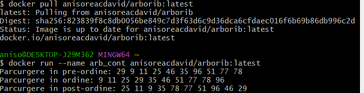

# Proiect: Parcurgerea Arborilor Binari

## Descriere
Acest proiect este o aplicație care vizualizează parcurgerea unui arbore binar în „pre-ordine”, „în ordine”, „post-ordine” și pe „nivel”.

### Motivarea
Arborii binari sunt o structură fundamentală de date utilizată frecvent în informatică pentru a organiza și gestiona informațiile. Înțelegerea modului de parcurgere a arborilor binari este esențială pentru studenți și profesioniști în domeniu, având aplicații în algoritmi, baze de date și multe altele.

### Scopul
Scopul acestui proiect este de a crea o aplicație care vizualizează diferitele moduri de parcurgere a unui arbore binar: „pre-ordine”, „în ordine”, „post-ordine” și „pe nivel”. Proiectul își propune să ajute utilizatorii să înțeleagă aceste concepte printr-o interfață interactivă.

## Mediul de Dezvoltare
- **C++**: Limbajul de programare utilizat pentru dezvoltarea aplicației.
- **Docker**: Containerizare pentru rularea aplicației într-un mediu izolat.
- **Sistem de operare**: Windows 11
- **IDE**: CLion

## Implementare
### Structura Arborelui Binar
- Fiecare nod conține o valoare și pointeri către subarborii stâng și drept.
- Funcționalitate pentru inserarea valorilor aleatoare și parcurgerea arborelui în diferite ordine:
  - **Pre-ordine**: Vizităm nodul curent, apoi subarborele stâng și apoi subarborele drept.
  - **În ordine**: Vizităm subarborele stâng, nodul curent și apoi subarborele drept.
  - **Post-ordine**: Vizităm subarborele stâng, subarborele drept și apoi nodul curent.
  - **Pe nivel**: Vizităm nodurile nivel cu nivel, utilizând o coadă pentru traversare.

## Modalitate de rulare

1. **Trage imaginea Docker**:  
   Descarcă imaginea Docker folosind comanda:
    ```bash
    docker pull anisoreacdavid/arborib:latest
    ```
   Această comandă va descărca imaginea cu tag-ul `latest` din registrul Docker Hub.

2. **Rulează containerul Docker**:  
   Creează și pornește un container bazat pe imaginea Docker:
    ```bash
    docker run --name arborib_container -d anisoreacdavid/arborib:latest
    ```
    - `--name arborib_container`: Atribuie un nume containerului pentru identificare ușoară.
    - `anisoreacdavid/arborib:latest`: Specifică imaginea Docker care va fi rulată.

3. **Oprește și șterge containerul (opțional)**:  
   Dacă dorești să oprești containerul:
    ```bash
    docker stop arborib_container
    ```
   Pentru a șterge containerul după oprire:
    ```bash
    docker rm arborib_container
    ```

## Rezultate
- Aplicația permite vizualizarea arborilor binari și a parcurgerilor acestora, oferind o metodă intuitivă de înțelegere a acestui concept.

## Capturi de ecran


## Bibliografie
- ChatGPT
- Docker Tutorial for Beginners - mCoding
- Git Tutorial - [W3Schools](https://www.w3schools.com/)
- Introduction to Binary Tree - [GeeksforGeeks](https://www.geeksforgeeks.org/introduction-to-binary-tree/)
